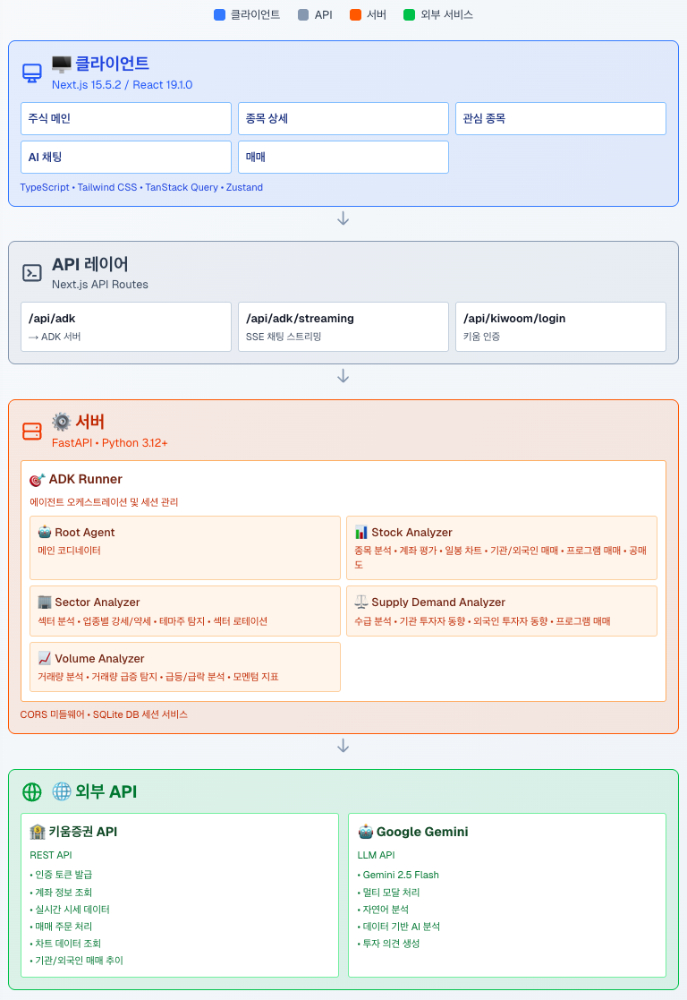
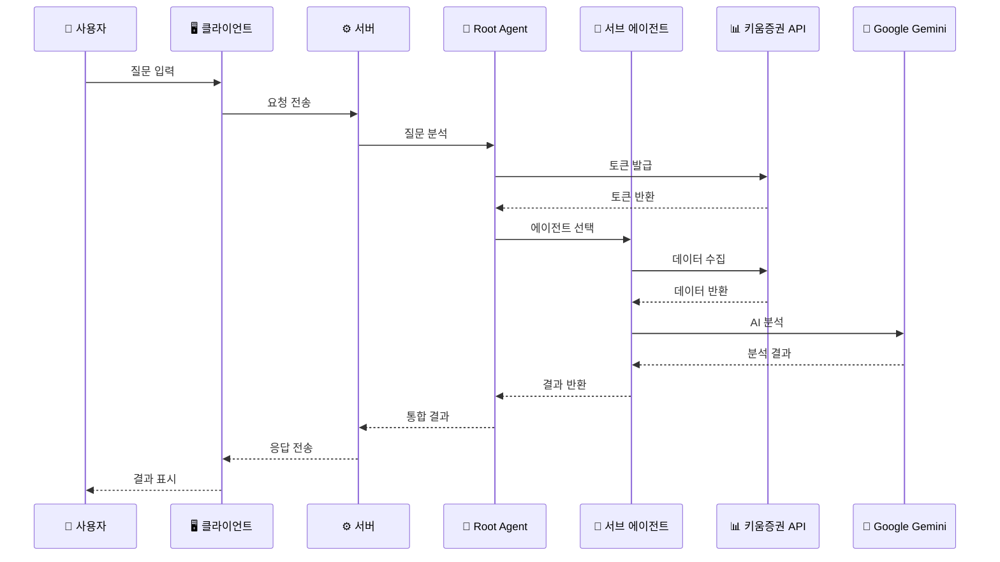
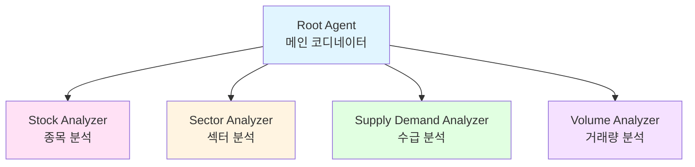

# 🥭 Mango Stock - AI 주식 투자 어시스턴트

> **멀티 에이전트 기반 주식 분석 및 투자 조언 플랫폼**

개인 투자자들이 복잡한 주식 시장에서 데이터 기반의 투자 결정을 내릴 수 있도록 돕는 AI 기반 주식 분석 서비스입니다. Google ADK(Agent Development Kit)와 키움증권 API를 활용하여 실시간 시장 데이터를 분석하고 맞춤형 투자 조언을 제공합니다.


---

## 📋 목차

- [프로젝트 소개](#-프로젝트-소개)
- [핵심 기능](#-핵심-기능)
- [기술 스택](#-기술-스택)
- [시스템 아키텍처](#-시스템-아키텍처)
- [시작하기](#-시작하기)
- [기여자](#-기여자)

---

## 🎯 프로젝트 소개

### 실전 AI 에이전트 프로덕트

**Mango Stock**은 실제로 동작하는 프로덕션 레벨의 멀티 에이전트 시스템입니다. **5개의 실전 AI 에이전트**(Root Agent + 4개 전문 Sub Agents)가 협력하여 복잡한 주식 분석 업무를 자동화하고, 사용자에게 데이터 기반의 투자 조언을 제공합니다.

### 문제 정의

개인 투자자들이 주식 투자 시 겪는 주요 어려움:

- **종목 선택의 어려움**: 수천 개의 상장 종목 중 투자할 종목을 선별하기 어려움
- **매수/매도 타이밍 판단**: 언제 매수하고 언제 매도해야 할지 판단하기 어려움
- **정보 과부하**: 수많은 뉴스와 분석 자료 중 핵심 정보를 파악하기 어려움
- **감정적 투자**: 객관적 데이터보다 감정에 의한 투자 결정

### 해결 방안

**멀티 에이전트 시스템**을 통해 각 전문 분야의 AI 에이전트가 협력하여 종합적인 투자 분석을 제공합니다. 마치 회사에서 마케팅팀, 개발팀, 기획팀이 협력하듯 각 에이전트가 전문 분야에서 소통하며 협업합니다.

**핵심 특징:**
- ✅ **5개의 실전 에이전트**: Root Agent + 4개 전문 Sub Agents (종목/섹터/수급/거래량 분석)
- ✅ **프로덕션 레벨**: 실제 사용 가능한 완전한 서비스
- ✅ **자동화된 워크플로우**: 복잡한 분석 업무를 에이전트가 자동 처리

---

## ✨ 핵심 기능

### 1. 보유 종목 분석 및 투자 조언
- 보유 종목의 평단가, 손익률, 수익률 실시간 확인
- 데이터 기반 매수/매도/홀딩 의견 제공
- 기술적 분석과 펀더멘털 분석을 통한 종합 판단

### 2. 종목별 상세 분석
- 차트 패턴, 거래량, 모멘텀 지표 분석
- 기관/외국인 매매 동향 추적
- 공매도 잔고 및 프로그램 매매 분석
- 업종 대비 상대 강도 비교

### 3. 시장 트렌드 분석
- 섹터별 강세/약세 분석
- 테마주 및 급등주 탐지
- 거래량 급증 종목 모니터링
- 기관 투자자 동향 파악

### 4. 실시간 주식 데이터
- 키움증권 API 연동으로 실시간 시세 조회
- 보유 종목 및 관심 종목 모니터링
- 일봉/분봉 차트 데이터 제공

### 5. AI 기반 채팅 인터페이스
- 자연어로 주식 관련 질문 가능
- 멀티 에이전트가 협력하여 종합 분석 제공
- 스트리밍 방식의 실시간 응답

---

## 🛠 기술 스택

### AI & 에이전트

| 카테고리 | 기술 |
|---------|------|
| **AI Framework** | Google ADK (Agent Development Kit) |
| **LLM API** | Google Gemini 2.5 Flash |
| **에이전트 오케스트레이션** | ADK Runner & Session Management |
| **프롬프트 엔지니어링** | 구조화된 프롬프트 템플릿 & 최적화 |
| **도구 통합** | Function Tools (10+ 키움증권 API 모듈) |
| **실전 에이전트 수** | 5개 (Root + 4개 Sub Agents) |

### Frontend (`client/`)

| 카테고리 | 기술 |
|---------|------|
| **Framework** | Next.js 15.5.2 (App Router) |
| **Language** | TypeScript |
| **UI Library** | React 19.1.0 |
| **Styling** | Tailwind CSS |
| **State Management** | Zustand |
| **Data Fetching** | TanStack Query (React Query) |
| **UI Components** | Radix UI |
| **Charts** | Recharts |
| **Animation** | Framer Motion |
| **Markdown** | React Markdown + Shiki |

### Backend (`server/`)

| 카테고리 | 기술 |
|---------|------|
| **API Framework** | FastAPI |
| **Language** | Python 3.12+ |
| **Package Manager** | UV |
| **Stock API** | 키움증권 REST API (10+ 엔드포인트 통합) |
| **Database** | SQLite (ADK 세션 관리) |
| **Real-time** | Server-Sent Events (SSE) |

---

## 🏗 시스템 아키텍처

### 전체 시스템 구조



### 데이터 흐름 (Request Flow)



### 에이전트 구조



### 실전 에이전트 구현

이 프로젝트는 **5개의 실전 AI 에이전트**를 구현한 멀티 에이전트 시스템입니다:

1. **Root Agent (메인 코디네이터)**: 사용자 질문 분석, 적절한 에이전트 라우팅, 키움증권 API 토큰 관리, 결과 통합
2. **Stock Analyzer Agent**: 보유 종목 분석, 기술적 분석, 수급 분석, 공매도 분석
3. **Sector Analyzer Agent**: 업종별 강세/약세 분석, 테마주 탐지, 섹터 로테이션 분석
4. **Supply Demand Analyzer Agent**: 기관/외국인 투자자 매매 동향 추적, 프로그램 매매 분석
5. **Volume Analyzer Agent**: 거래량 급증 종목 탐지, 급등/급락 분석, 모멘텀 지표 분석

### 프롬프트 엔지니어링 & 시스템 설계

- **도메인 특화 프롬프트**: 각 에이전트가 담당하는 분야에 맞춘 전문 프롬프트 설계 및 최적화
- **구조화된 출력**: JSON 형식의 일관된 응답 구조로 파싱 및 후처리 용이
- **확장 가능한 아키텍처**: 새로운 에이전트 추가 시 기존 시스템에 영향 없이 확장 가능
- **도구 모듈화**: 10개 이상의 키움증권 API 도구를 모듈화하여 재사용성 극대화

### 멀티 에이전트의 장점

- ✅ **전문성**: 각 에이전트가 특정 분야에 특화되어 더 정확하고 깊이 있는 분석 가능
- ✅ **신뢰성**: 에이전트들이 서로의 결과를 검토하고 보완하여 실수나 편향을 줄임
- ✅ **확장성**: 새로운 기능이 필요할 때 해당 분야 에이전트만 추가하면 됨
- ✅ **정확성**: 일반 답변보다 토큰을 많이 사용하지만, 그만큼 전문성 있는 답변 가능

---


## 🚀 시작하기

### 사전 요구사항

- **Node.js** 20.18.0 이상
- **Python** 3.12 이상
- **UV** (Python 패키지 관리자)
- **키움증권 계좌** 및 API 키
- **Google Cloud Project** 및 API 키

### 설치 및 실행

#### 1. 저장소 클론

```bash
git clone https://github.com/miachoidev/mango-stock-monorepo.git
cd mango-stock-monorepo
```

#### 2. 서버 설정 및 실행

```bash
cd server

# UV 설치 (macOS)
brew install uv

# Python 3.12 설치
uv python install 3.12

# 가상환경 생성 및 의존성 설치
uv venv --python 3.12
source .venv/bin/activate
uv sync

# 환경 변수 설정
cp .env.example .env
# .env 파일에 다음 정보 입력:
# GOOGLE_CLOUD_PROJECT=your_project_id
# GOOGLE_API_KEY=your_google_api_key
# KIWOOM_APPKEY=your_kiwoom_appkey
# KIWOOM_SECRETKEY=your_kiwoom_secretkey

# 서버 실행
python main.py
```

서버가 `http://localhost:8000`에서 실행됩니다.

#### 3. 클라이언트 설정 및 실행

```bash
cd client

# 의존성 설치
npm install

# 환경 변수 설정
cp .env.example .env.local
# .env.local 파일에 다음 정보 입력:
# KIWOOM_API_KEY=your_kiwoom_api_key
# ADK_SERVER_URL=http://localhost:8000

# 개발 서버 실행
npm run dev
```

클라이언트가 `http://localhost:3000`에서 실행됩니다.

### API 키 발급

- **Google API Key**: [Google Cloud Console](https://console.cloud.google.com/)에서 Generative Language API와 Vertex AI API 활성화 후 API 키 발급
- **키움증권 API Key**: [키움 REST API 가이드](https://openapi.kiwoom.com/guide/apiguide)에서 API 사용신청 후 App Key와 Secret Key 발급

---

## 👥 기여자

<table>
  <tr>
    <td align="center">
      <a href="https://github.com/miachoidev">
        
        <br />
        <sub><b>miachoi</b></sub>
      </a>
      <br />
      <b>🏗️ 멀티 에이전트 시스템 아키텍처 설계</b>
      <br />
      <sub>
        <b>시스템 아키텍처 설계</b><br/>
        멀티 에이전트 오케스트레이션 설계<br/>
        에이전트별 도메인 특화 프롬프트 설계 & 최적화<br/>
        구조화된 출력 및 컨텍스트 관리<br/>
        LLM API & 도구 통합</b><br/>
        Google Gemini API 활용<br/>
        키움증권 API 10+ 도구 모듈 개발<br/>
      </sub>
    </td>
    <td align="center">
      <a href="https://github.com/hyunhong">
        
        <br />
        <sub><b>현홍</b></sub>
      </a>
      <br />
      <b>🎨 프론트엔드 & 서버 인프라</b>
      <br />
      <sub>
        Next.js 15 기반 UI/UX 구현<br/>
        AI 채팅 인터페이스 & 스트리밍<br/>
        실시간 주식 데이터 시각화<br/>
        종목 상세 & 차트 컴포넌트<br/>
        관심 종목 & 보유 종목 관리<br/>
        Google ADK 서버 틀 구축<br/>
        반응형 디자인 & 애니메이션
      </sub>
    </td>
  </tr>
</table>

---

## 📝 라이선스

이 프로젝트는 개인 포트폴리오 프로젝트입니다.

---

## 🔗 관련 링크

- [서버 레포지토리](https://github.com/bbnerino/mango-stock-server)
- [클라이언트 레포지토리](https://github.com/bbnerino/mango-stock-client)
- [키움증권 OpenAPI](https://openapi.kiwoom.com/)
- [Google ADK 문서](https://ai.google.dev/adk)

---

**Made with ❤️ by the Mango Stock Team**

