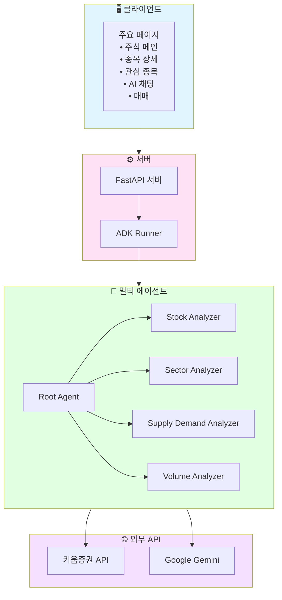
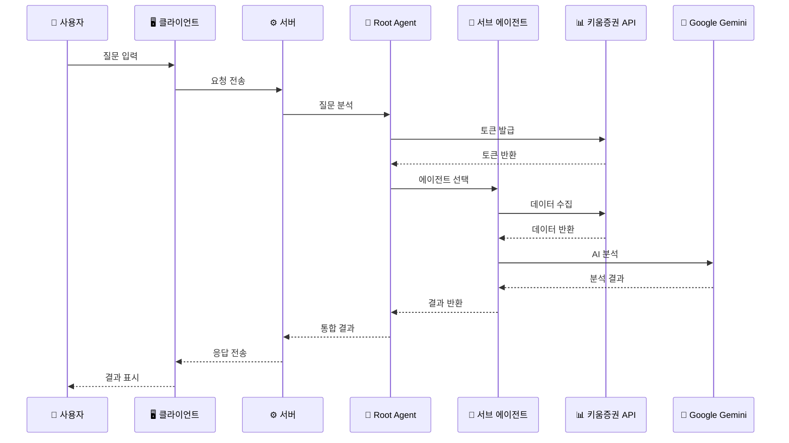
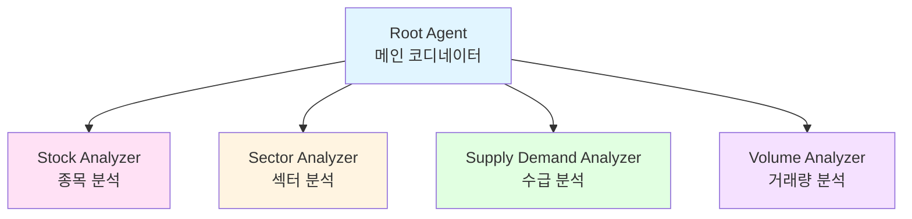

# 🥭 Mango Stock - AI 주식 투자 어시스턴트

> **멀티 에이전트 기반 주식 분석 및 투자 조언 플랫폼**

개인 투자자들이 복잡한 주식 시장에서 데이터 기반의 투자 결정을 내릴 수 있도록 돕는 AI 기반 주식 분석 서비스입니다. Google ADK(Agent Development Kit)와 키움증권 API를 활용하여 실시간 시장 데이터를 분석하고 맞춤형 투자 조언을 제공합니다.


---

## 📋 목차

- [프로젝트 소개](#-프로젝트-소개)
- [핵심 기능](#-핵심-기능)
- [기술 스택](#-기술-스택)
- [시스템 아키텍처](#-시스템-아키텍처)
- [프로젝트 구조](#-프로젝트-구조)
- [주요 기능 상세](#-주요-기능-상세)
- [시작하기](#-시작하기)
- [기여자](#-기여자)

---

## 🎯 프로젝트 소개

### 문제 정의

개인 투자자들이 주식 투자 시 겪는 주요 어려움:

- **종목 선택의 어려움**: 수천 개의 상장 종목 중 투자할 종목을 선별하기 어려움
- **매수/매도 타이밍 판단**: 언제 매수하고 언제 매도해야 할지 판단하기 어려움
- **정보 과부하**: 수많은 뉴스와 분석 자료 중 핵심 정보를 파악하기 어려움
- **감정적 투자**: 객관적 데이터보다 감정에 의한 투자 결정

### 해결 방안

**멀티 에이전트 시스템**을 통해 각 전문 분야의 AI 에이전트가 협력하여 종합적인 투자 분석을 제공합니다. 마치 회사에서 마케팅팀, 개발팀, 기획팀이 협력하듯 각 에이전트가 전문 분야에서 소통하며 협업합니다.

---

## 🎨 에이전트 상세

### 1. 종목 분석 에이전트 (Stock Analyzer Agent)

**기능:**
- 보유 종목의 평단가, 손익률, 수익률 분석
- 기술적 분석: 차트 패턴, 이동평균, 거래량 분석
- 수급 분석: 기관/외국인 매매 동향, 프로그램 매매 추이
- 공매도 분석: 공매도 잔고 및 추세 분석
- 업종 비교: 해당 종목의 업종 대비 상대 강도 분석

**출력:**
- 매수/매도/홀딩 의견
- 근거 설명 (3가지 이상)
- 목표가 및 손절가 제시

### 2. 섹터 분석 에이전트 (Sector Analyzer Agent)

**기능:**
- 업종별 강세/약세 분석
- 테마주 탐지 및 분석
- 섹터 로테이션 분석
- 업종별 상대 강도 비교

### 3. 수급 분석 에이전트 (Supply Demand Analyzer Agent)

**기능:**
- 기관 투자자 매매 동향 추적
- 외국인 투자자 매매 동향 추적
- 프로그램 매매 추이 분석
- 대형주/중형주/소형주별 수급 분석

### 4. 거래량 분석 에이전트 (Volume Analyzer Agent)

**기능:**
- 거래량 급증 종목 탐지
- 급등/급락 종목 분석
- 모멘텀 지표 분석
- 거래량 패턴 분석

---

## ✨ 핵심 기능

### 1. 보유 종목 분석 및 투자 조언
- 보유 종목의 평단가, 손익률, 수익률 실시간 확인
- 데이터 기반 매수/매도/홀딩 의견 제공
- 기술적 분석과 펀더멘털 분석을 통한 종합 판단

### 2. 종목별 상세 분석
- 차트 패턴, 거래량, 모멘텀 지표 분석
- 기관/외국인 매매 동향 추적
- 공매도 잔고 및 프로그램 매매 분석
- 업종 대비 상대 강도 비교

### 3. 시장 트렌드 분석
- 섹터별 강세/약세 분석
- 테마주 및 급등주 탐지
- 거래량 급증 종목 모니터링
- 기관 투자자 동향 파악

### 4. 실시간 주식 데이터
- 키움증권 API 연동으로 실시간 시세 조회
- 보유 종목 및 관심 종목 모니터링
- 일봉/분봉 차트 데이터 제공

### 5. AI 기반 채팅 인터페이스
- 자연어로 주식 관련 질문 가능
- 멀티 에이전트가 협력하여 종합 분석 제공
- 스트리밍 방식의 실시간 응답

---

## 🛠 기술 스택

### Frontend (`client/`)

| 카테고리 | 기술 |
|---------|------|
| **Framework** | Next.js 15.5.2 (App Router) |
| **Language** | TypeScript |
| **UI Library** | React 19.1.0 |
| **Styling** | Tailwind CSS |
| **State Management** | Zustand |
| **Data Fetching** | TanStack Query (React Query) |
| **UI Components** | Radix UI |
| **Charts** | Recharts |
| **Animation** | Framer Motion |
| **Markdown** | React Markdown + Shiki |

### Backend (`server/`)

| 카테고리 | 기술 |
|---------|------|
| **AI Framework** | Google ADK (Agent Development Kit) |
| **LLM** | Google Gemini 2.5 Flash |
| **API Framework** | FastAPI |
| **Language** | Python 3.12+ |
| **Package Manager** | UV |
| **Stock API** | 키움증권 REST API |
| **Database** | SQLite (ADK 세션 관리) |
| **Real-time** | Server-Sent Events (SSE) |

---

## 🏗 시스템 아키텍처

### 전체 시스템 구조 (시각화)



### 전체 시스템 구조

```
┌─────────────────────────────────────────────────────────────┐
│                    클라이언트 (Client)                       │
│  ┌──────────────────────────────────────────────────────┐   │
│  │  Next.js 15.5.2 (React 19.1.0)                      │   │
│  │  - TypeScript                                         │   │
│  │  - Tailwind CSS                                       │   │
│  │  - TanStack Query (React Query)                      │   │
│  │  - Zustand (State Management)                        │   │
│  └──────────────────────────────────────────────────────┘   │
│                                                               │
│  주요 페이지:                                                 │
│  • 주식 메인 페이지 (/stock)                                │
│  • 종목 상세 페이지 (/stock/detail)                         │
│  • 관심 종목 페이지 (/stock/watchlist)                      │
│  • AI 채팅 페이지 (/(chat))                                │
│  • 매매 페이지 (/stock/stock-trade)                         │
└───────────────────────┬─────────────────────────────────────┘
                        │
                        │ HTTP/SSE
                        │
┌───────────────────────▼─────────────────────────────────────┐
│              API 레이어 (Next.js API Routes)                   │
│  ┌──────────────────────────────────────────────────────┐   │
│  │  /api/adk              → ADK 서버 연동                │   │
│  │  /api/adk/streaming    → 스트리밍 채팅                │   │
│  │  /api/kiwoom/login     → 키움증권 로그인              │   │
│  └──────────────────────────────────────────────────────┘   │
└───────────────────────┬─────────────────────────────────────┘
                        │
                        │ HTTP/SSE
                        │
┌───────────────────────▼─────────────────────────────────────┐
│                  서버 (Server)                                │
│  ┌──────────────────────────────────────────────────────┐   │
│  │  FastAPI (Python 3.12+)                               │   │
│  │  - CORS Middleware                                     │   │
│  │  - Database Session Service (SQLite)                  │   │
│  └──────────────────────────────────────────────────────┘   │
│                                                               │
│  ┌──────────────────────────────────────────────────────┐   │
│  │  Google ADK Runner                                    │   │
│  │  - Agent Orchestration                                │   │
│  │  - Session Management                                 │   │
│  └──────────────────────────────────────────────────────┘   │
│                                                               │
│  ┌──────────────────────────────────────────────────────┐   │
│  │  Root Agent (메인 코디네이터)                         │   │
│  │  ┌────────────────────────────────────────────────┐ │   │
│  │  │  Stock Analyzer Agent (종목 분석)                │ │   │
│  │  │  • 계좌 평가 현황 조회                           │ │   │
│  │  │  • 주식 일봉 차트 분석                           │ │   │
│  │  │  • 기관/외국인 매매 추이                         │ │   │
│  │  │  • 프로그램 매매 분석                            │ │   │
│  │  │  • 공매도 추이 분석                              │ │   │
│  │  └────────────────────────────────────────────────┘ │   │
│  │  ┌────────────────────────────────────────────────┐ │   │
│  │  │  Sector Analyzer Agent (섹터 분석)              │ │   │
│  │  │  • 업종별 강세/약세 분석                          │ │   │
│  │  │  • 테마주 탐지                                   │ │   │
│  │  │  • 섹터 로테이션 분석                            │ │   │
│  │  └────────────────────────────────────────────────┘ │   │
│  │  ┌────────────────────────────────────────────────┐ │   │
│  │  │  Supply Demand Analyzer Agent (수급 분석)        │ │   │
│  │  │  • 기관 투자자 매매 동향                         │ │   │
│  │  │  • 외국인 투자자 매매 동향                       │ │   │
│  │  │  • 프로그램 매매 추이                           │ │   │
│  │  └────────────────────────────────────────────────┘ │   │
│  │  ┌────────────────────────────────────────────────┐ │   │
│  │  │  Volume Analyzer Agent (거래량 분석)            │ │   │
│  │  │  • 거래량 급증 종목 탐지                         │ │   │
│  │  │  • 급등/급락 종목 분석                           │ │   │
│  │  │  • 모멘텀 지표 분석                              │ │   │
│  │  └────────────────────────────────────────────────┘ │   │
│  └──────────────────────────────────────────────────────┘   │
└───────────┬───────────────────────┬───────────────────────┘
            │                       │
            │                       │
    ┌───────▼────────┐      ┌───────▼────────┐
    │  키움증권 API   │      │  Google Gemini│
    │  REST API       │      │  LLM API       │
    │                │      │                │
    │  • 인증 토큰    │      │  • Gemini 2.5  │
    │  • 계좌 정보    │      │    Flash        │
    │  • 시세 데이터  │      │  • 멀티 모달    │
    │  • 매매 주문    │      │    처리         │
    │  • 차트 데이터  │      │                │
    └────────────────┘      └────────────────┘
```

### 데이터 흐름 (Request Flow)



### 에이전트 구조



### 에이전트 협업 프로세스

1. **사용자 질문 입력** → 클라이언트에서 자연어 질문 입력
2. **API 요청** → Next.js API Route를 통해 FastAPI 서버로 전송
3. **Root Agent 분석** → 질문 유형 분석 및 토큰 발급
4. **에이전트 선택** → 질문 유형에 맞는 전문 에이전트 선택
5. **데이터 수집** → 각 에이전트가 키움증권 API를 통해 데이터 수집
6. **AI 분석** → Google Gemini를 통해 수집된 데이터 분석
7. **결과 통합** → Root Agent가 모든 에이전트의 결과를 통합
8. **응답 전송** → 스트리밍 또는 일반 응답으로 클라이언트에 전송

### 멀티 에이전트의 장점

- ✅ **전문성**: 각 에이전트가 특정 분야에 특화되어 더 정확하고 깊이 있는 분석 가능
- ✅ **신뢰성**: 에이전트들이 서로의 결과를 검토하고 보완하여 실수나 편향을 줄임
- ✅ **확장성**: 새로운 기능이 필요할 때 해당 분야 에이전트만 추가하면 됨
- ✅ **정확성**: 일반 답변보다 토큰을 많이 사용하지만, 그만큼 전문성 있는 답변 가능

---

## 📁 프로젝트 구조

```
mango-stock-monorepo/
├── client/                          # Next.js 프론트엔드
│   ├── src/
│   │   ├── app/                    # Next.js App Router
│   │   │   ├── api/               # API Routes
│   │   │   │   ├── adk/          # ADK 서버 연동
│   │   │   │   └── kiwoom/       # 키움 API 연동
│   │   │   ├── stock/            # 주식 관련 페이지
│   │   │   │   ├── page.tsx      # 주식 메인 페이지
│   │   │   │   ├── detail/       # 종목 상세 페이지
│   │   │   │   ├── watchlist/    # 관심 종목 페이지
│   │   │   │   └── stock-trade/  # 매매 페이지
│   │   │   └── (chat)/          # AI 채팅 페이지
│   │   ├── components/           # React 컴포넌트
│   │   │   ├── chat/            # 채팅 UI 컴포넌트
│   │   │   ├── stock/           # 주식 관련 컴포넌트
│   │   │   └── ui/              # 공통 UI 컴포넌트
│   │   ├── hooks/               # Custom Hooks
│   │   ├── types/               # TypeScript 타입 정의
│   │   └── utils/               # 유틸리티 함수
│   │       └── api/             # API 호출 함수들
│   ├── package.json
│   └── README.md
│
├── server/                         # Python 백엔드
│   ├── stock/                     # 주식 분석 에이전트
│   │   ├── agent.py             # Root Agent 정의
│   │   ├── prompt.py            # Root Agent 프롬프트
│   │   ├── sub_agents/          # 서브 에이전트들
│   │   │   ├── stock_analyzer/      # 종목 분석 에이전트
│   │   │   ├── sector_analyzer/     # 섹터 분석 에이전트
│   │   │   ├── supply_demand_analyzer/  # 수급 분석 에이전트
│   │   │   └── volume_analyzer/     # 거래량 분석 에이전트
│   │   └── utils/
│   │       └── tools/            # 키움 API 도구들
│   │           ├── kiwoom_auth_tools.py
│   │           ├── kiwoom_account_tools.py
│   │           ├── kiwoom_chart_tools.py
│   │           ├── kiwoom_market_tools.py
│   │           └── ...
│   ├── database/                  # SQLite 데이터베이스
│   ├── main.py                   # FastAPI 서버 진입점
│   ├── pyproject.toml           # Python 프로젝트 설정
│   └── README.md
│
├── merge-repos.sh                # 모노레포 병합 스크립트
└── README.md                    # 프로젝트 메인 README
```

---


## 🚀 시작하기

### 사전 요구사항

- **Node.js** 20.18.0 이상
- **Python** 3.12 이상
- **UV** (Python 패키지 관리자)
- **키움증권 계좌** 및 API 키
- **Google Cloud Project** 및 API 키

### 설치 및 실행

#### 1. 저장소 클론

```bash
git clone https://github.com/miachoidev/mango-stock-monorepo.git
cd mango-stock-monorepo
```

#### 2. 서버 설정 및 실행

```bash
cd server

# UV 설치 (macOS)
brew install uv

# Python 3.12 설치
uv python install 3.12

# 가상환경 생성 및 의존성 설치
uv venv --python 3.12
source .venv/bin/activate
uv sync

# 환경 변수 설정
cp .env.example .env
# .env 파일에 다음 정보 입력:
# GOOGLE_CLOUD_PROJECT=your_project_id
# GOOGLE_API_KEY=your_google_api_key
# KIWOOM_APPKEY=your_kiwoom_appkey
# KIWOOM_SECRETKEY=your_kiwoom_secretkey

# 서버 실행
python main.py
```

서버가 `http://localhost:8000`에서 실행됩니다.

#### 3. 클라이언트 설정 및 실행

```bash
cd client

# 의존성 설치
npm install

# 환경 변수 설정
cp .env.example .env.local
# .env.local 파일에 다음 정보 입력:
# KIWOOM_API_KEY=your_kiwoom_api_key
# ADK_SERVER_URL=http://localhost:8000

# 개발 서버 실행
npm run dev
```

클라이언트가 `http://localhost:3000`에서 실행됩니다.

### API 키 발급 방법

#### Google API Key

1. [Google Cloud Console](https://console.cloud.google.com/) 접속
2. 프로젝트 생성 또는 선택
3. **API 활성화**:
   - "API 및 서비스" > "라이브러리" 이동
   - "Generative Language API" 검색하여 **활성화**
   - "Vertex AI API" 검색하여 **활성화**
4. "API 및 서비스" > "사용자 인증 정보" 이동
5. "+ 사용자 인증 정보 만들기" > "API 키" 선택
6. 생성된 API 키를 `.env` 파일에 추가

#### 키움증권 API Key

1. [키움 REST API 가이드](https://openapi.kiwoom.com/guide/apiguide) 접속
2. 키움증권 계정으로 로그인
3. API 사용신청 진행
4. 발급받은 App Key와 Secret Key를 `.env` 파일에 추가

---

## 👥 기여자

이 프로젝트는 다음 기여자들의 작업을 통합한 모노레포입니다:

- **서버 개발**: [bbnerino/mango-stock-server](https://github.com/bbnerino/mango-stock-server)
- **클라이언트 개발**: [bbnerino/mango-stock-client](https://github.com/bbnerino/mango-stock-client)
- **모노레포 통합**: [miachoidev/mango-stock-monorepo](https://github.com/miachoidev/mango-stock-monorepo)

---

## 📝 라이선스

이 프로젝트는 개인 포트폴리오 프로젝트입니다.

---

## 🔗 관련 링크

- [서버 레포지토리](https://github.com/bbnerino/mango-stock-server)
- [클라이언트 레포지토리](https://github.com/bbnerino/mango-stock-client)
- [키움증권 OpenAPI](https://openapi.kiwoom.com/)
- [Google ADK 문서](https://ai.google.dev/adk)

---

**Made with ❤️ by the Mango Stock Team**

